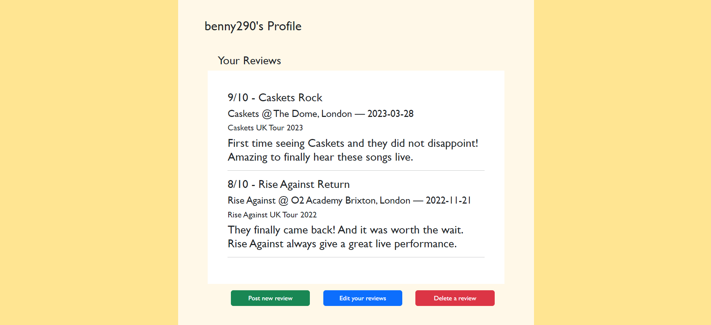

# Gigaholic Web App

This project is a web application for posting reviews of live music concerts. It uses a relational database to collect, store, modify and delete concert review data with PostgreSQL, and is served by Flask. The final project is hosted on Heroku.

View the live project [here](https://gigaholic.herokuapp.com/)

---

## UX

### User Stories

- Goals for visitors:

    - View posted concert reviews to read about others' experiences at live music shows and get opinions on which artists are good to see live

    - Search/filter posted reviews by a variety of categories such as date posted, artist, tour and venue to easily find what they are looking for

    - Create an account

    - Log in and out of their account

    - Have account data stored securely i.e. plain text passwords are not stored in the database

    - Post their own new reviews to the website

    - Visit their profile to see their posted reviews

    - Edit their posted reviews

    - Delete their posted reviews

    - Trust that their reviews cannot be edited or deleted by another user

- Goals for site owner:

    - Manage the site, users and database

    - View posted reviews on site and in the database

    - Use the site themselves to add their own concert reviews

---

## Design and Planning

### Website

The design of the website was mapped out using wireframes, before using HTML, CSS and Bootstrap to replicate it in the live project.

I used a hero image showing a concert scene below the header and navbar which, along with the site name, Gigaholic, and the line 'Search for a gig review' on the image, make it immediately clear to visitors that the purpose of the site is for reading/posting concert reviews.

The colour scheme of the rest of the site matches the colours of the image, which are shades of burgundy, orange and yellow.

### Database

I used Excel to create this mockup of the database prior to starting this project, in order to get an idea of the tables I would need to create and how they would be connected through primary and foreign keys.

In the finished project, the database follows a similar structure. There are 11 tables altogether, though two of them, Album and Song, are unused, as this was for a feature I did not have time to implement (see the [Improvements](#improvements-and-features-to-add) section). I have created the Entity Relationship Diagram (ERD) below to illustrate the database structure and how the tables link together. This was generated using the built-in ERD feature in pgAdmin. I have not included the Album and Song tables in this diagram as they are not currently in use in the project.

There are 6 main tables: Users, Review, Concert, Artist, Venue and Tour. These tables are all linked together through primary and foreign keys. Entries in the Review table contain a review ID, as well as review title, text and rating. This table references the user ID, so reviews can be connected to the user that wrote them, as well as the concert ID, so that reviews are connected to the relevant concert. These are both many-to-one relationships, as a user can write many reviews, but a review can only have one author; likewise, a concert can have many reviews but a single review can only talk about one concert.

The Concert table contains further information on the concert being reviewed, such as the concert date, the artist, by referencing the artist ID from the Artist table, the venue, by referencing the venue ID, and the tour, by referencing the tour ID. These are also many to one relations: an artist can perform multiple concerts, a venue can host multiple concerts, and a tour contains multiple concerts. In theory, the concert-artist relationship should be many-to-many, as usually there are multiple artists performing at a concert, however this would have added a lot of complexity to the data structure, so I decided to limit it to one artist per concert at present.

The Artist table contains the artist ID, artist name, and a genre ID, which links to a Genre table. This table has not been used in the site yet, but in theory as well as filtering by artist, tour, venue etc., you could also filter by genre when searching for concert reviews.

The Venue table contains venue ID, venue name, and city ID, referencing a City table, which also then references a Country table. This information can be used in reviews to more clearly specify the location of the concert, and could also be used to search reviews by city or country.

---

## Features

### Header and Navbar

The header is a simple title bar featuring the name of the site and, depending on whether the user is logged in or not, either a 'Log In' button or a 'Profile' button and a 'Log Out' button. Clicking the site name will take you to the landing page.

Underneath is a navbar with links to the landing page, which shows recently posted reviews, and pages to get reviews filtered by artist, tour and venue. As the pages are built off a template, the active tab is changed according to the current window pathname using a switch case statement in JavaScript.

### Hero

The landing page features a hero image from a concert. Within this is a search bar with a search button, though this feature currently doesn't work as unfortunately I did not have time to implement this (see [Improvements](#improvements-and-features-to-add) below). If the visitor is logged in to an account, a personalised greeting is displayed above the search bar, as well as a 'Post a review' button next to it. This feature is only shown to logged in users as a user ID is required to post new reviews to the website.

On the other review pages, this hero element is still present but is smaller to take up less space on the page and bring more focus to the reviews themselves.

### Recent Reviews

The landing page displays the most recently posted reviews. This is achieved by using the Fetch API in JavaScript to retrieve all the reviews from the database, converting this data into JSON objects, and then sorting by the review ID in descending order to show newest posted reviews first. This data is looped through to build a div for each review containing the review rating, title, and body text, as well as associated information about the artist and tour, the concert date and location, and the user who posted the review. This list of reviews is then inserted into the HTML document to be viewable by the user.

### Reviews by Pages

When the Reviews by Artist tab is visited, the Fetch API is used to retrieve all the artists in the database and display them as an unordered list.

These are also links which, when clicked, take you to a page that displays all the reviews for that artist. The pathname also changes to show the artist ID of the selected artist.

This review list is built in a similar way, by using the window pathname to make a Fetch request to retrieve the review data for the chosen artist, which is looped through to build the review divs and display them on the page.

The Reviews by Tour and Reviews by Venue tabs are unfinished, but would have behaved in much the same way, retrieving all the tours and venues from the database, displaying them in an alphabetised list, and when clicked would take the user to a page showing all the reviews in the database for that tour/venue.

### Log In Page

If a user wants to post a review or manage their reviews, they need to log into an account. The log in page features a simple form containing username and password fields and a 'Log in' button, on a background of the same concert hero image from the other pages. If correct credentials are entered, the user will be logged in and redirected to the homepage; if the credentials are incorrect, a message is flashed to indicate this and prompt the user to check their details and try again.

Some pages of the site require the user to be logged in, such as the profile or any of the post/edit/delete forms. If a visitor tries to access one of these pages without being logged in, they will be redirected to the log in page.

Unfortunately there is currently no sign up feature within the site to create new user accounts, so at present this can only be done by directly adding a new user into the database.

Passwords are hashed before being stored in the database using the PBKDF2 standard, as this is one of the main go-tos for password hashing in web application development. Password hashing is done so that, should a data leak occur, no plain text passwords are discoverable, leading to user accounts being compromised. As part of PBKDF2, only the hash is stored with the user in the database, so when a user attempts to log in, the plain text input is hashed to check if it matches the hash stored for that user.

### Profile

When a user visits their profile, they are able to see a list of all the reviews they have posted. This is achieved by using Flask's current user to get the user ID of the currently logged in user with a Fetch request, followed by another Fetch to get the reviews for that user ID and display them to the page in the usual way.

Beneath this are buttons that allow the user to post a new review, edit their existing reviews, and delete their reviews, providing full CRUD functionality to the site.

### Create - Post Review Form

When a user clicks the 'Post a review' button on any page or 'Post new review' on their profile, they are redirected to the post review form. This allows the user to pick a concert from a dropdown list built by fetching all the concerts currently in the database and appending them as options to a select element. The user is then required to fill in a review title, a rating (which has to be a number between 0 and 10), and their review text.

The submit button then passes the form data to JavaScript with an event listener, and Fetch is used to post this data as a new review to the database. If the Fetch request has been completed successfully, a modal is displayed to indicate this to the user, and closing the modal redirects them to the landing page, where they can see their review amongst the newly posted reviews.

This new review can also be seen as a new entry in the database Review table.

This feature demonstrates Create functionality in this project.

### Read - Review Pages and Profile

Data from the database is retrieved and displayed to the user in many areas of the site, as mentioned above - the [Recent page](#recent-reviews) displays reviews from the database in order of most recently posted; the [Reviews by Pages](#reviews-by-pages) show lists of the artists/tours/venues in the database and all the reviews for a selected artist/tour/venue currently in the database; the [Profile page](#profile) displays all the reviews posted by the currently logged in user.

These elements all demonstrate Read functionality.

### Update - Edit Review Form

Similar to the post review buttons, clicking the 'Edit your reviews' button on a user's profile redirects the user to the edit review form. This uses the current user's ID to fetch all their posted reviews and build a dropdown. The concert ID is also attached to each option in the review dropdown, and this is used to get the associated concert information for the currently selected review, to then update the option in the concert dropdown accordingly. The review ID of the selected review is used get the data for that review and then pre-populate the form fields with the current review title, rating and text so they can then be edited. These updates happen both when the content is loaded and when the review dropdown is changed.

As with the post form, JavaScript is then used to submit this data, but this time with a patch method in order to update the review with the ID passed in, and success modal is displayed if this request was successful. Closing this redirects the user to their profile, where they can see the changes have been applied.

These updates are also seen in the database table for the same review entry.

This feature demonstrates Update functionality.

### Delete - Delete Review Form

The delete form page uses the same method as the edit page to build a dropdown of the user's existing reviews.

The delete button uses a Fetch request with the delete method to remove the review with the ID passed in from the database. Again, a success modal is displayed and redirects to the user's profile when closed, showing that the deleted review is no longer present.

The review has also been deleted from the database Review table.

This feature demonstrates Delete functionality.

### Improvements and Features to Add

Unfortunately due to time constraints I was unable to completely finish all features and pages of this application. Some of the features I wanted to add are:

- The search bar would ideally allow you to search all the reviews in the database and return all the reviews containing your search, but this feature doesn't currently work.
- All aspects of a review should be clickable - for instance, clicking the artist in a review should bring you to the artist page showing all reviews for that artist; clicking the username should bring you to the profile of that user with all their reviews; clicking the venue should bring to the venue page for concert played at that location. At the moment this isn't the case and reviews are read-only and not able to be interacted with.
- I was originally thinking of having the ability to link songs that were played at the concert into the review, but had to skip this feature to focus on the reviews themselves.
- At the moment a user can only edit and delete reviews from their profile - ideally there should be an edit and delete button on the reviews themselves, but this would have been more time consuming to implement so I had to limit it to just the profile for now.

---

## Project Structure - Backend

### Database

To create the database used in this project, I first created an account on ElephantSQL, which is a service that provides a fully managed database solution, meaning they take care of maintenance, reliability and updating the database server all for me. I have used this for my database as they offer a free tier (Tiny Turtle). The downside of this is that only a small number of connections can be made to the database at one time, however given the current scope of this project that was adequate as not many users would be attempting to access the site at once. If I were to expand this project into a full-scale web application, I would likely have to upgrade to one of the more extensive plans which offer a greater number of connections and larger storage capacity for the database, as this would allow more users to use the site at once without running into issues accessing the database, as well as allowing for the increase in the amount of data being stored. I chose to use the Google Compute Engine europe-west2 datacenter as this is located closest to my location in London, keeping request latency to a minimum for those in this region, as this is the area I expect most of my users to be at the moment.

Once this database instance had been created, I then used pgAdmin to connect to the database by providing the connection details from ElephantSQL such as the host name, username and password. Once connected, I could use pgAdmin to easily access and manage my database and tables, including creating the tables, adding and editing data, and using the pgAdmin ERD tool to plan out the database schema.

The first step was to add my required tables and fill in my data. These tables are detailed in the [Database Design](#database) section above. I used the Excel mockup as a basis and copied the information across into the database.

In order to then use the data from these tables in my application, I created a class in Python to represent each table and define what a row looks like in that table. There is also as a base database model that handles connection to the database, as well as the Create, Read, Update and Delete (CRUD) operations. This class has no knowledge of what table or data it is working on though, hence the need for a model per table.

I then created a set of 'repository' classes for each table. It is these repositories that contain the SQL to actually perform CRUD operations on each table, and they all follow a similar pattern/structure.

I chose to use a SQL schema rather than a NoSQL method as the data used in this project is highly relational, which is easier to achieve in SQL compared with other non-SQL methods. Also, as the schema is unlikely to change, the flexible nature of NoSQL isnt really a benefit in this case.

---

## Technologies

### Languages

- HTML5
- CSS3
- JavaScript
- Python with Flask
- SQL (PostgreSQL)

### Frameworks, Libraries, External Stylesheets etc

- [Git](https://git-scm.com/) for version control
- [GitHub](https://github.com/) to store the project repository and back up git commits
- [Bootstrap v5.3](https://getbootstrap.com/docs/5.3/getting-started/introduction/) to assist in creating the structure and design of the webpages
- [ElephantSQL](https://www.elephantsql.com/) to manage the PostgreSQL database
- [pgAdmin](https://www.pgadmin.org/) to view and edit the data and create the ERD
- [Microsoft Excel](https://www.microsoft.com/en-us/microsoft-365/excel) to create the initial mockup of the database
- [Font Awesome](https://fontawesome.com/) for the search icon
- [Justinmind](https://www.justinmind.com/) to create the wireframe

---

## Testing

### User Experience

My project was tested thoroughly by myself and others throughout the development process to ensure that the application and its features worked as expected.

Site Function

- All the navigation links/buttons have been tested and go to the correct locations, with no broken links.
- The navbar correctly indicates which tab the user is currently on.
- Post, edit and review buttons take the user to the relevant form and allow them to post, edit or delete a review - if this request is completed successfully, a modal is displayed to inform the user.

Data Storage and Retrieval

- Reviews displayed to the page contain the correct information retrieved from the database, including review title, review text and review rating, as well as the associated artist, venue and tour information, and the details of the user that posted it.
- Post button successfully posts a new review to the database with the information provided by the user. This can be verified by viewing the database with pgAdmin or visiting any page where the review would be displayed, such as recent reviews or the user's profile.
- The newest posted reviews appear first on the home/recent page, as they are sorted in reverse order of review ID (newer reviews will have a larger review ID as they have been created later).
- All the logged in user's reviews (and no other user's) are correctly displayed on their profile.
- Edit button successfully patches the selected review and updates the relevant fields in the database, as can be verified in pgAdmin or by viewing the updated review on the page.
- Delete button successfully deletes the selected review from the database; deleted reviews will no longer appear in the database or anywhere on the site.

Authorisation and Security

- If correct credentials are supplied, the user is able to successfully log into their account.
- Login fails and flashes a message if user credentials do not match a user in the database.
- Pages that require login correctly bounce the visitor to the login page if they are not logged in. Originally, all pages required login as if a user tried to access any page with the 'Post a review' button on it without being logged in, this would cause an error, given the current user's user ID is required to be passed in for the button to function - if no user was logged in this could not happen. This was not ideal however as users without an account would then not be able to access the site at all or even really understand the purpose of it, as all they could see is the login page. To fix this, I made it so only the profile and post/edit/delete forms required login and all other pages would be accessible without an account, however the 'Post a review' button would only be shown to logged in users.
- Logged in users will see a personalised greeting with their username on the landing page, as well as a link to access their profile from any page; logged out users will see a 'Log In' button instead.
- Only the logged in user's reviews are available for them to edit and delete from their profile, so no one can edit or delete someone else's review.
- Log out button logs the current user out successfully.
- Passwords are hashed before being stored in the database to avoid exposing sensitive log in details.

### Responsiveness

The use of Bootstrap has helped to make this website somewhat responsive, however unfortunately, due to time constraints on this project, I was unable to make it fully responsive in its current state. It is usable on all screen sizes, however the sizing of things such as fonts makes the appearance rather unappealing. This is something I would like to improve in the future, but at this stage I had to prioritise the overall functionality of the site, the database and the CRUD features as these are the main focus of this project.

### Compatibility

The app was tested on a variety of internet browsers including Google Chrome, Microsoft Edge, Mozilla Firefox and Safari to ensure it is fully compatible. No compatibility issues were found on any of these browsers.

### Validation

The website passed through the [W3C validator](https://validator.w3.org/) with no issues when using its URI. When each HTML page was checked by direct input, there were some errors, but only those to do with the Flask templating used as these are of course not recognised as standard HTML.

The CSS passed through the [Jigsaw validator](https://jigsaw.w3.org/css-validator/) with no issues when checked by direct input. When the site URI was used, some errors were found, but only those to do with Bootstrap's CSS.

### Accessibility

[WAVE](https://wave.webaim.org/) was used to assess the accessbility of the website. No errors or alerts were given, and only one contrast error was found.

### Known Bugs

As my database uses the free tier of ElephantSQL, there can be issues with retrieving data from the database when too many connections are attempted at the same time. This has been minimised by adding logic to close connections if any errors are encountered, as in previous versions these were being left open and causing lots of issues accessing the database during testing.

---

## Deployment

The final project has been deployed to Heroku. To do this, I created a Heroku continuous delivery (CD) pipeline to run the application with one dyno. The pipeline is connected to the main branch of the project's GitHub repository, so whenever new code is committed and pushed to GitHub, it is automatically deployed by Heroku to the live project. As this is a solo project, I have been committing my changes directly to the main branch, however in multi-person projects it would be better to work in a separate branch, then create a pull request to merge changes into the main branch after testing.

To run the application, I have created a Procfile which runs the run.py script using Gunicorn to forward client requests to the Flask server within run.py. All PIP packages needed to allow the Flask server to run are contained in a requirements.txt file which Heroku then installs when it builds the dyno.

With more time, the deployment process could be improved to have two dynos, one pulling from a development branch automatically, and the main one only being updated manually when development has been fully tested. Automatic continuous integration (CI) testing could also be set up so that builds are tested before Heroku tries to deploy them.

HTTPS has been enabled on the pipeline using the Heroku automatic SSL certificate setting. This ensures that all connections to the site from the client are encrypted and secure.

---

## Credits

### Code

This [stackoverflow post](https://stackoverflow.com/questions/7478366/create-dynamic-urls-in-flask-with-url-for/35936261#35936261) was used to further my understanding of dynamic URLs in Flask.

[This guide](https://www.digitalocean.com/community/tutorials/how-to-add-authentication-to-your-app-with-flask-login) was used to help set up my Flask login system.

I used [guidance from W3Schools](https://www.w3schools.com/js/js_array_sort.asp) on sorting arrays in order to sort the lists of reviews by review ID and the list of tours alphabetically.

I also referred to the [W3Schools guidance](https://www.w3schools.com/jsref/event_preventdefault.asp) on the prevent default method, as well as [this stackoverflow post](https://stackoverflow.com/questions/46640024/how-do-i-post-form-data-with-fetch-api/46642899#46642899) and the [MDN docs](https://developer.mozilla.org/en-US/docs/Web/API/FormData/FormData) on form data when submitting my forms using JavaScript and the Fetch API.

### Content

All review content was created by myself and other testers.

### Media

[This](https://www.pexels.com/photo/people-at-concert-1105666/) image from Pexels is used for the hero image.