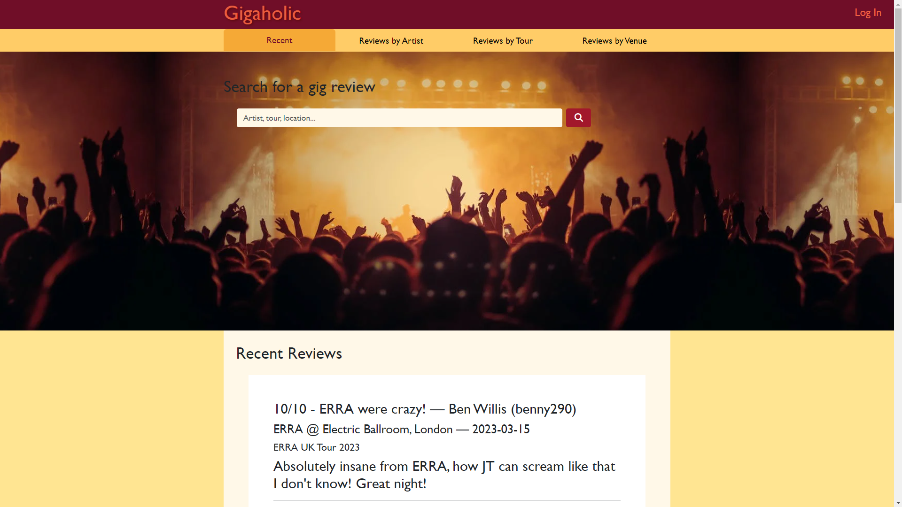

# Gigaholic Web App

This project is a web application for posting reviews of live music concerts. It uses a relational database to collect, store, modify and delete concert review data with PostgreSQL, and is served by Flask. The final project is hosted on Heroku.

View the live project [here](https://gigaholic.herokuapp.com/)

---

## UX

### User Stories

- Goals for visitors:

    - Log in and out of their account

    - Have account data stored securely i.e. plain text passwords are not stored in the database

    - View posted concert reviews to read about others' experiences at live music shows and get opinions on which artists are good to see live

    - Search/filter posted reviews by a variety of categories such as date posted, artist, tour and venue to easily find what they are looking for

    - Post their own new reviews to the website

    - Visit their profile to see their posted reviews

    - Edit their posted reviews

    - Delete their posted reviews

    - Trust that their reviews cannot be edited or deleted by another user

- Goals for site owner:

    - Manage the site, users and database

    - View posted reviews on site and in the database

    - Use the site themselves to add their own concert reviews

## Features

### Header and Navbar

The header is a simple title bar featuring the name of the site and, depending on whether the user is logged in or not, either a log in button or a profile button and a log out button. Clicking the site name will take you to the landing page.

Underneath is a navbar with links to the landing page, which shows recently posted reviews, and pages to get reviews filtered by artist, tour and venue. As the pages are built off a template, the active tab is changed according to the current window pathname using a switch case statement in JavaScript.

### Log In Page

If a visitor tries to access a page of the site without being logged in, they will be redirected to the log in page. If incorrect credentials are used, a message is flashed to indicate this.

There is currently no site feature to create users, so at present this can only be done by directly adding a new user into the database.

Passwords are hashed before being stored in the database to avoid plain text passwords being discoverable.

### Hero

The landing page features a hero image from a concert. Within this is a search bar and a greeting which is personalised to the user, and a post review button. On the other review pages, this feature is still present but is smaller to take up less space on the page and bring more focus to the reviews themselves.

The search button currently doesn't work as unfortunately I didn't have time to implement this feature, however the post button does and will bring you to the post review page.

### Recent Reviews

The landing page displays the most recently posted reviews. This is achieved by using the Fetch API in JavaScript to retrieve all the reviews from the database, converting this data into JSON objects, and then sorting by the review ID in descending order to show newest posted reviews first. This data is looped through to build a div for each review containing the review rating, title, and body text, as well as associated information about the artist and tour, the concert date and location, and the user who posted the review. This list of reviews is then inserted into the HTML document to be viewable by the user.

### Reviews by Pages

When the Reviews by Artist tab is visited, the Fetch API is used to retrieve all the artists in the database and display them as an unordered list.

These are also links which, when clicked, take you to a page that displays all the reviews for that artist. The pathname also changes to show the artist ID of the selected artist.

This review list is built in a similar way, by using the window pathname to make a Fetch request to retrieve the review data for the chosen artist, which is looped through to build the review divs and display them on the page.

The Reviews by Tour and Reviews by Venue tabs are unfinished, but would have behaved in much the same way, retrieving all the tours and venues from the database, displaying them in an alphabetised list, and when clicked would take the user to a page showing all the reviews in the database for that tour/venue.

### Profile

When a user visits their profile, they are able to see a list of all the reviews they have posted. This is achieved by using Flask's current user to get the user ID of the currently logged in user with a Fetch request, followed by another Fetch to get the reviews for that user ID and display them to the page in the usual way.

Beneath this are buttons that allow the user to post a new review, edit their existing reviews, and delete their reviews.

### Post Review Form

When a user clicks the 'post a review' button on any page, they are redirected to the post review form. This allows the user to pick a concert from a dropdown list built by fetching all the concerts currently in the database and appending them as options to a select element. The user is then required to fill in a review title, a rating (which has to be a number between 0 and 10), and their review text.

The submit button then passes the form data to JavaScript with an event listener, and Fetch is used to post this data as a new review to the database. If the Fetch request has been completed successfully, a modal is displayed to indicate this to the user, and closing the modal redirects them to the landing page.

### Edit Review Form

Similarly, clicking the edit reviews button redirects the user to the edit review form. This uses the current user's ID to fetch all their posted reviews and build a dropdown. The concert ID is also attached to each option in the review dropdown, and this is used to get the associated concert information for the currently selected review, to then update the option in the concert dropdown accordingly. The review ID of the selected reivew is used get the data for that review and then pre-populate the form fields with the current review title, rating and text so they can then be edited. These updates happen both when the content is loaded and when the review dropdown is changed.

As with the post form, JavaScript is then used to submit this data, but this time with a patch method in order to update the review with the ID passed in, and success modal is displayed if this request was successful. Closing this redirects the user to their profile.

### Delete Review Form

The delete form page uses the same method as the edit page to build a dropdown of the user's existing reviews.

The delete button uses a Fetch request with the delete method to remove the review with the ID passed in from the database. Again, a success modal is displayed and redirects to the user's profile when closed.

### Improvements and Features to Add

Unfortunately due to time constraints I was unable to completely finish all features and pages of this application. Some of the features I wanted to add are:

- The search bar would ideally allow you to search all the reviews in the database and return all the reviews containing your search, but this feature doesn't currently work.
- All aspects of a review should be clickable - for instance, clicking the artist in a review should bring you to the artist page showing all reviews for that artist; clicking the username should bring you to the profile of that user with all their reviews; clicking the venue should bring to the venue page for concert played at that location. At the moment this isn't the case and reviews are just read-only and not able to be interacted with.
- I was originally thinking of having the ability to link songs that were played at the concert into the review, but had to skip this feature to focus on the reviews themselves.
- At the moment a user can only edit and delete reviews from their profile - ideally there should be an edit and delete button on the reviews themselves, but this would have been more time consuming to implement so I had to limit it to just the profile for now

---

## Design and Planning

### Website

The design of the website was mapped out using a wireframe, before using HTML, CSS and Bootstrap to replicate it in the live project.

### Database

I used Excel to create this mockup of the database prior to starting this project, in order to get an idea of the tables I would need to create and how they would be connected through primary and foreign keys.

---

## Technologies

### Languages

- HTML5
- CSS3
- JavaScript
- Python with Flask
- SQL (PostgreSQL)

### Frameworks, Libraries, External Stylesheets etc

- [Git](https://git-scm.com/) for version control
- [GitHub](https://github.com/) to store the project repository and back up git commits
- [Bootstrap v5.3](https://getbootstrap.com/docs/5.3/getting-started/introduction/) to assist in creating the structure and design of the webpages
- [Font Awesome](https://fontawesome.com/) for the search icon
- [Justinmind](https://www.justinmind.com/) to create the wireframe

---

## Testing

### User Experience

My project was tested thoroughly by myself and others throughout the development process to ensure that the application and its features worked as expected.

- All the navigation links/buttons have been tested and go to the correct locations
- Reviews displayed to the page all contain the correct information retrieved from the database
- Only the logged in user's reviews are displayed on their profile and available for them to edit and delete, so no one can edit or delete someone else's review
- Post, edit and delete buttons all function to post new reviews, patch existing reviews, and delete reviews from the database
- All pages correctly bounce the visitor to the login page if they are not logged in
- Login fails and flashes a message if user credentials do not match a user in the database
- Log out button logs current user out successfully
- Passwords are hashed before being stored in the database to avoid exposing sensitive log in details

### Validation

The website passed through the [W3C validator](https://validator.w3.org/) with no issues when using its URI. When each HTML page was checked by direct input, there were some errors, but only those to do with the Flask templating used as these are of course not recognised as standard HTML.

The CSS passed through the [Jigsaw validator](https://jigsaw.w3.org/css-validator/) with no issues when checked by direct input. When the site URI was used, some errors were found, but only those to do with Bootstrap's CSS.

### Accessibility

[WAVE](https://wave.webaim.org/) was used to assess the accessbility of the website.

### Known Bugs

As my database uses the free tier of ElephantSQL, there can be issues with retrieving data from the database when too many connections are attempted at the same time. This has been minimised by adding logic to close connections if any errors are encountered, as in previous versions these were being left open and causing lots of issues accessing the database during testing.

---

## Deployment

The final project has been deployed to Heroku.

---

## Credits

### Code

[This guide](https://www.digitalocean.com/community/tutorials/how-to-add-authentication-to-your-app-with-flask-login) was used to help set up my Flask login system.

[This stackoverflow post](https://stackoverflow.com/questions/7478366/create-dynamic-urls-in-flask-with-url-for/35936261#35936261) was used to further my understanding of dynamic URLs in Flask.

### Content

All review content was created by myself and other testers.

### Media

[This](https://www.pexels.com/photo/people-at-concert-1105666/) image from Pexels is used for the hero image.